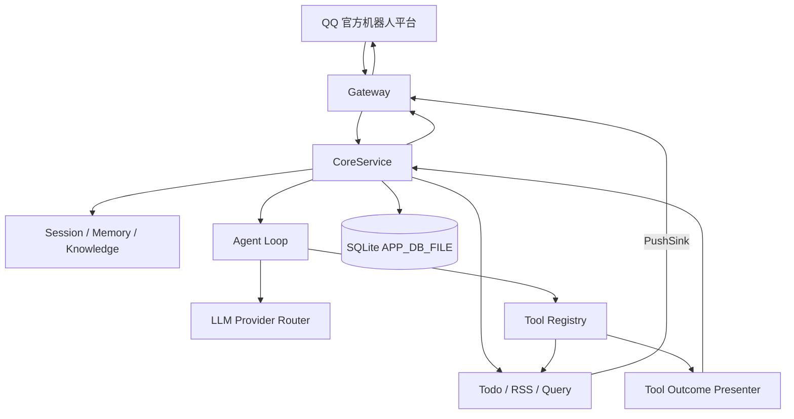

<div align="center">
  
  <h1>QQ Maid Bot</h1>
  <p><strong>一个会聊天、会记事、会调用工具，也会主动推送的自托管 QQ AI 助手。</strong></p>
  <p>
    <a href="https://github.com/kuliantnt/qq-maid-bot/actions/workflows/ci.yml"></a>
    <a href="https://github.com/kuliantnt/qq-maid-bot/releases"></a>
    <a href="LICENSE"></a>
    <a href="https://deps.rs/repo/github/kuliantnt/qq-maid-bot"></a>
    
    
    
  </p>
  <p><sub>约 22 MiB 可执行文件 · 约 24 MiB 常驻内存 · 默认空闲时 3 个线程 · 以及持续膨胀的代码量</sub></p>
</div>

QQ Maid Bot 使用 Rust 构建，通过 QQ 官方机器人接口运行。它不是简单地把消息转发给大模型，而是把长期会话、受控记忆、Todo、RSS、知识检索、联网查询、Agent Loop、工具调用和主动推送装进一个长期在线的机器人进程里。

> Rust 单进程 · QQ 官方接口 · Provider 无关 Agent Loop · 受控长期记忆 · 主动推送 · 模型自动降级

当前版本：**v0.11.1**。这一版补齐成员编号旧链路移除的升级说明，修复非流式回复发送链路，并完善多平台 Release 构建矩阵。详细变更见 [CHANGELOG.md](./CHANGELOG.md)。

## 项目定位

项目当前主线是：**通用 Agent 底座 + 个人 / 办公助理能力**。

它也支持群聊、天气、RSS、知识库等场景，但目标不是再造一个只能陪聊的机器人，而是让 QQ 里的自然语言真正连接到可验证、可恢复、可持续运行的任务系统。

最开始只是想写一个 Todo。后来 Todo 长出了 LLM、RSS、SQLite、RAG、记忆系统、模型路由、Agent Loop 和一整套运维工具。事情逐渐失控，但服务器目前还算冷静。

## 项目亮点

### 🧰 不只是“模型说它做了”

私聊普通对话可以进入 Provider 无关的 Agent Loop。模型按需调用白名单工具，Core 根据真实工具结果生成可信回复，而不是仅凭模型文案判断操作是否成功。

当前天气和 Todo 已接入确定性展示；Todo 的新增、修改、完成、恢复、取消和删除都有明确执行结果。遇到目标不清楚时，会进入澄清或确认流程，后续消息可以在受限范围内恢复任务。

### 🧠 不只是一次性聊天

会话可以新建、恢复、重命名和压缩，机器人能够持续维护上下文，而不是每条消息都从零开始。

长期记忆采用确认式流程：普通聊天不会偷偷写入记忆，只有用户明确提交并确认后才会保存。

### 📬 不只是等人发消息

内置 Todo、每日提醒、RSS / Atom 订阅和主动推送能力。

机器人既可以回答问题，也可以在任务到期、订阅更新时主动发送消息。

### 🛡️ 不把稳定性押在一个模型上

独立的 Rust LLM 层支持 Provider 路由、模型候选链、错误分类、流式协议和自动降级。

当主模型或流式接口临时不可用时，可以根据配置尝试后备模型或兼容接口，而不是直接让整个机器人停止工作。

### 💬 更像正常聊天，而不是接口回包

私聊最终回复默认使用 QQ 原生文本流发送，并支持延迟 typing 状态。首帧不可用时会降级为普通完整回复，不会为了补发而重新运行 Agent Loop 或重复执行工具。

### 🦀 为长期在线运行而设计

运行时只需一个 `qq-maid-bot` 进程，主要业务状态统一保存在 SQLite。

项目提供部署脚本、服务控制、健康检查、链路诊断和结构化日志，适合部署在个人服务器上持续运行。

## 它能做什么

| 场景 | 当前能力 |
| --- | --- |
| 日常聊天 | 多轮会话、自动标题、上下文压缩、历史恢复、Markdown 回复 |
| Agent 与工具 | Provider 无关 Agent Loop、同轮多工具串行执行、澄清 / 确认 / 受限恢复、可信结果编排 |
| 任务管理 | Todo 增删改查、自然语言时间解析、状态看板、定时提醒、确定性写操作回执 |
| 信息订阅 | RSS / Atom 轮询、去重、翻译和主动推送 |
| 长期记忆 | 生成记忆草稿，确认后保存，可查看和修改 |
| 私人知识库 | 自动索引本地 Markdown，并按需注入相关内容 |
| 联网查询 | Web Search、天气、列车时刻和翻译 |
| 消息体验 | 私聊最终回复流、QQ 原生 typing、普通消息自动降级 |
| 模型基础设施 | Provider 路由、候选链、fallback、SSE、usage 和 Agent Loop 观测 |
| 运维诊断 | `/healthz`、`/ping`、部署脚本、服务控制和网络诊断 |

## 使用示例

```text
你：帮我新增待办：明天下午三点检查服务器日志
机器人：已新增待办：检查服务器日志
        时间：明天 15:00

你：查看已取消的待办
机器人：⛔ 已取消 · 共 3 项
        1. 和老公出门
        2. 和老公吃饭
        3. 买飞机票

你：把这些都删了
机器人：这些待办将被永久删除，确认继续吗？

你：杭州明天要带伞吗
机器人：正在查询天气……
        明天有雨，建议带伞。

你：/rss add https://example.com/feed.xml Rust News
机器人：已添加订阅：Rust News

你：/memory 我习惯使用 Asia/Shanghai 时区
机器人：已生成长期记忆草稿，请确认后保存。
```

<p align="center">
  <a href="docs/img/readme-chat-demo.png">
    
  </a>
  <a href="docs/img/readme-health-demo.png">
    
  </a>
</p>

## 快速开始

### 前置条件

* Linux、macOS 或 Windows 主机，能够正常访问 QQ 开放平台和所配置的模型 API
* QQ 官方机器人 AppID 和 AppSecret（[QQ 开放平台](https://q.qq.com/) 申请）
* 一个受支持模型的 API Key（OpenAI 兼容接口或 DeepSeek）
* 基本命令行操作经验

> Release 会预构建 Linux x86_64 / ARM64、macOS Intel / Apple Silicon、Windows x86_64 包。一键部署和 `botctl.sh` 服务管理仍主要面向 Linux。

### 路径一：Linux Release 包（推荐，无需安装 Rust）

从 [Releases](https://github.com/kuliantnt/qq-maid-bot/releases) 下载与系统匹配的最新包，例如 `qq-maid-bot-vX.Y.Z-linux-x86_64.tar.gz`：

```bash
tar -xzf qq-maid-bot-vX.Y.Z-linux-x86_64.tar.gz
cd qq-maid-bot-vX.Y.Z-linux-x86_64

# 1. 配置环境变量
cp config/.env.example config/.env
vim config/.env

# 2. 启动
./botctl.sh start

# 3. 验证
./botctl.sh status
./botctl.sh health
```

最少需要填写：`QQ_BOT_APP_ID`、`QQ_BOT_APP_SECRET`，以及所选模型 Provider 的 API Key。使用第三方或自建兼容接口时，再配置对应的 Base URL。

完整配置项说明见 [runtime/README.md](./runtime/README.md)。

### 路径二：源码构建（需要 Rust 工具链）

#### Linux

```bash
# 安装 Rust（如未安装）
curl --proto '=https' --tlsv1.2 -sSf https://sh.rustup.rs | sh

# 克隆并构建
git clone https://github.com/kuliantnt/qq-maid-bot.git
cd qq-maid-bot

cp runtime/config/.env.example runtime/config/.env
vim runtime/config/.env

bash scripts/deploy-local.sh    # 构建 → 安装 → 启动

# 验证
runtime/botctl.sh status
runtime/botctl.sh health
```

#### Windows

```powershell
# 安装 Rust（如未安装）
# 从 https://rustup.rs 下载 rustup-init.exe 并运行

# 克隆并构建
git clone https://github.com/kuliantnt/qq-maid-bot.git
cd qq-maid-bot

# Windows MSVC 工具链可能需要 Visual Studio Build Tools
# 安装时勾选“使用 C++ 的桌面开发”
cargo build --release

# 准备配置
Copy-Item runtime\config\.env.example runtime\config\.env
# 编辑 runtime\config\.env

# 启动（程序从工作目录读取 config\.env）
cd runtime
..\target\release\qq-maid-bot.exe
```

Windows 下程序以前台方式运行，关闭终端即停止。如需长期后台运行，可使用 Windows 任务计划程序或第三方服务管理工具；项目目前暂未提供官方 Windows 服务脚本。

### 遇到问题？

| 问题 | 答案 |
| --- | --- |
| 启动后立即退出 | 查看日志最后几十行。通常是 `config/.env` 缺少必填项或 API Key 无效。 |
| QQ 收不到消息 | 确认 QQ 开放平台已启用机器人事件权限；查看 Gateway 是否成功鉴权并建立 WebSocket 连接。 |
| 模型调用报错 | 确认 `LLM_PROVIDER` 与 `LLM_MODEL` 前缀匹配。用 GLM / Qwen / Ollama 等 OpenAI 兼容网关时，需要设 `OPENAI_API_MODE=chat_only`。 |
| 群聊不回复 | 默认 `mention` 模式只响应 @ 和回复机器人。主动响应需设 `QQ_MAID_GROUP_MESSAGE_MODE=active` 和 `QQ_MAID_GROUP_ACTIVE_KEYWORDS`。 |
| 怎么诊断 | `./botctl.sh health` 确认服务存活；`./diagnose-network.sh` 检查配置、网络和模型连通性。 |
| 升级后启动失败 | 对比新版 `config/.env.example` 是否新增必填项；检查 `PROMPT_DIR` 等路径是否仍然有效。 |
| 日志在哪 | Linux 可用 `./botctl.sh logs`，默认日志文件 `logs/qq-maid-bot.log`。Windows 前台运行时直接查看终端输出。临时排障可设 `RUST_LOG=debug`。 |

> 以上命令主要适用于 Linux Release 部署；Windows 源码运行时可直接查看终端日志。

更多帮助：

* 配置项详解：[runtime/README.md](./runtime/README.md)
* 配置模板：[runtime/config/.env.example](./runtime/config/.env.example)
* 开发调试：Linux 使用 `make run`（前台运行）；Windows 见 [docs/DEVELOPMENT.md](./docs/DEVELOPMENT.md)
* 开发维护：[docs/DEVELOPMENT.md](./docs/DEVELOPMENT.md)

## 运行表现

Gateway、Core 和 LLM 模块由同一个 `qq-maid-bot` 进程统一启动和管理。

一次约 80 分钟实际群聊连续使用后的运行快照：

| 指标 | 结果 |
| --- | ---: |
| 常驻内存 RSS | 约 24 MiB |
| 线程数 | 3 |
| 文件描述符 | 17 |
| Swap | 0 |

观察期间内存仅有小幅波动，线程数和文件描述符数量保持稳定，未发现明显的资源持续增长。

> 数据来自特定 Linux 环境下的实际运行快照，仅用于展示资源占用量级，不构成标准性能基准或长期稳定性保证。

写了很多 Rust，最终只是为了让服务器安静地睡觉。

## 架构概览



一次普通私聊 Agent 请求大致会经过：

```text
QQ 消息
  → Gateway 接收与聚合
  → Core 装配会话、记忆与知识上下文
  → Agent Loop 请求模型
  → 模型按需调用白名单 Tool
  → Tool 返回结构化真实结果
  → Core 编排可信回复事件
  → Gateway 以流式或普通消息发送
```

Gateway 与 Core 由同一进程装配，聊天、命令、`/ping check`、RSS 和 Todo 主动推送都走进程内强类型接口；外部 HTTP 仅保留 `GET /healthz`，以及运行和 Markdown 渲染所需的少量辅助接口。

项目内部通过根目录 Cargo Workspace 统一管理，保持明确的模块边界：

* `qq-maid-gateway-rs/` — QQ 事件接收、消息聚合、typing、流式与普通回复发送、`/ping` 诊断
* `qq-maid-core/` — CoreService、会话、记忆、知识库、Todo、RSS、业务 Tool、可信结果编排和命令
* `qq-maid-llm/` — 模型协议、Provider 路由、fallback、SSE、Agent Loop、Tool Loop 和健康观测
* `qq-maid-common/` — 时间、日期和时区等共享基础工具

同一个架构，换个说法：

```text
用户说话
  ↓
女仆长接单
  ↓
各部门互相甩锅
  ↓
工具拿真实结果说话
  ↓
SQLite 留档
  ↓
大模型继续背锅
```

## 安全边界

Tool Calling 不等于把宿主机交给模型。

* 只有注册到 Tool Registry 的白名单工具可以被调用
* 工具拥有独立参数校验、权限和资源边界
* 高风险 Todo 操作需要确认
* 澄清恢复只允许在原任务的候选边界内继续
* 群聊默认不进入 Tool Loop；确需试用时必须显式开启 `TOOL_CALLING_GROUP_ENABLED`
* slash 命令、文件处理和宿主机代码执行不会进入普通聊天 Tool Loop
* 工具成功与否以真实执行结果为准，不以模型自述为准

## 开发调试

开发或排查问题时，可以在前台启动：

```bash
make run
```

`make run` 以前台方式启动 `qq-maid-bot`，方便直接观察输出。模块说明见 [qq-maid-core/README.md](./qq-maid-core/README.md)。

## 常用指令

完整命令列表和用法见 [开发文档](docs/DEVELOPMENT.md)。常用指令速查：

<details>
<summary>展开</summary>

```text
/new 新话题
/resume          /恢复
/state           /状态
/compact

/memory 内容     /记忆 内容
/memory show 1
/memory edit 1 新内容

帮我新增待办：明天下午检查日志
/todo             /待办
完成第一条待办

/rss add https://example.com/feed.xml 示例订阅
/rss              /订阅

/查 今天的 Rust 新闻
/火车 G1
/天气杭州
/翻译日语 你好
```

</details>

## 项目状态与路线

项目仍在快速开发，主要面向个人部署和开发者使用。目前没有图形化管理后台，部署者需要具备基本的命令行、环境变量和 API 配置经验。

当前优先方向：

* 继续扩展统一 Agent Loop 和业务 Tool，而不是为每个自然语言表达堆独立分支
* 将 Todo、RSS 以及后续能力统一关联到主动推送与调度体系
* 完善办公 Agent 和个人助理场景
* 保留并继续打磨群聊能力，但不让娱乐功能反过来绑架底层架构
* 清理旧兼容链路、过期测试和历史包袱，为后续大版本瘦身

QQ 官方机器人功能仍受平台权限、审核和接口规则限制。Linux 的部署与服务管理支持更完整；Windows 当前主要通过源码构建并以前台方式运行。

## 参与开发

这个项目同时踩在通用 Agent、个人助理、办公自动化和群聊机器人几条线上，一个人确实容易写着写着就天亮了。

欢迎通过 Issue、PR、讨论和实际部署反馈参与。可以从文档、Provider 兼容、业务 Tool、QQ 平台适配、测试或运维脚本切入，不要求先看懂全部代码。

* 贡献指南：[CONTRIBUTING.md](./CONTRIBUTING.md)
* 鸣谢：[CONTRIBUTING.md#鸣谢](./CONTRIBUTING.md#鸣谢)
* Issues：[GitHub Issues](https://github.com/kuliantnt/qq-maid-bot/issues)

## 版本升级

当前稳定版本为 **v0.11.1**。版本升级前请先阅读 [CHANGELOG.md](./CHANGELOG.md)，并对比新版 `runtime/config/.env.example`。

较早版本从 v0.3.x 升级到 v0.4.0 涉及单进程架构迁移，仍需参考 [v0.4.0 迁移说明](./CHANGELOG.md#v040)。

## 配置和隐私提醒

* 不要提交 API Key、QQ AppSecret、Token、OpenID、群 ID、聊天记录或真实用户数据。
* 不要将真实 Prompt、Markdown 知识资料、SQLite 数据库和日志提交到公开仓库。
* 公开仓库只提供 `.example` 模板，例如 [runtime/config/.env.example](./runtime/config/.env.example)。
* 私有配置和运行数据应放在仓库外，或放在被 `.gitignore` 忽略的目录中。
* 诊断和日志默认保持脱敏；临时开启 verbose 日志后，排障结束应关闭。

## 今天女仆会不会罢工

- [x] 能聊天
- [x] 能记 Todo
- [x] 能看天气
- [x] 能读 RSS
- [x] 能自动切换模型
- [x] 能查知识库
- [x] 有 Provider 无关的统一 Agent Loop
- [x] 能在私聊中自主调用天气和 Todo Tool
- [x] 能对 Todo 写操作生成可验证的确定性回执
- [x] 能处理 Todo 澄清、确认和受限恢复
- [x] 支持 QQ 原生 typing 和私聊最终回复流
- [ ] 接入更多可验证的业务 Tool
- [ ] 统一 Todo、RSS 与后续能力的主动推送调度
- [ ] 真正理解人类
- [ ] 阻止作者继续重构

## ⭐ Star History

如果喜欢这个项目，请给个 Star ⭐

[](https://star-history.com/#kuliantnt/qq-maid-bot&Date)

## 文档导航

* 版本记录：[CHANGELOG.md](./CHANGELOG.md)
* 部署运行说明：[runtime/README.md](./runtime/README.md)
* 配置模板：[runtime/config/.env.example](./runtime/config/.env.example)
* Core 模块文档：[qq-maid-core/README.md](./qq-maid-core/README.md)
* LLM 基础设施文档：[qq-maid-llm/README.md](./qq-maid-llm/README.md)
* Gateway 文档：[qq-maid-gateway-rs/README.md](./qq-maid-gateway-rs/README.md)
* 开发维护文档：[docs/DEVELOPMENT.md](./docs/DEVELOPMENT.md)
* 贡献指南：[CONTRIBUTING.md](./CONTRIBUTING.md)
* 鸣谢：[CONTRIBUTING.md#鸣谢](./CONTRIBUTING.md#鸣谢)
* Makefile：[Makefile](./Makefile)

## 你可能不需要它，如果：

- 你只想要一个十行 Python 自动回复脚本
- 你不想维护数据库
- 你认为几万行 Rust 不算轻量
- 你希望模型可以不经确认直接操作宿主机
- 你不会在凌晨三点突然重构整个 LLM 层

## License

本项目基于 [MIT License](./LICENSE) 开源。

<!--
你居然看到了这里。

运行：
qq-maid-bot --summon-maid
-->
