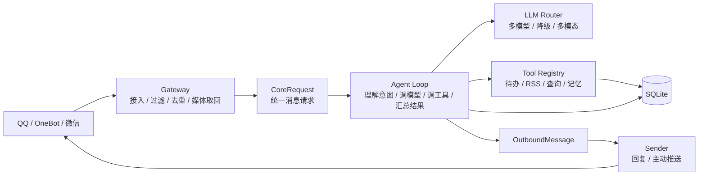

<div align="center">
  
  <h1>小女仆机器人</h1>
  <p><strong>一个会聊天、会记事、会调用工具，也会主动推送的轻量、自托管、多入口 AI Agent 机器人。</strong></p>
  <p>
    <a href="https://github.com/kuliantnt/qq-maid-bot/actions/workflows/ci.yml"></a>
    <a href="https://github.com/kuliantnt/qq-maid-bot/releases"></a>
    <a href="LICENSE"></a>
    <a href="https://deps.rs/repo/github/kuliantnt/qq-maid-bot"></a>
    
    
  </p>
  <p><sub>Rust 单进程 · 约 25 MiB 常驻内存 · 默认空闲时 3 个线程 · Provider 无关 Agent Loop · 多模态输入 · 主动推送 · 模型自动降级</sub></p>
</div>

> 💡 仓库早期以 QQ 机器人为主，因此仍保留 `qq-maid-bot` 名称。当前项目正在从 QQ 官方机器人演进为多入口平台型小女仆机器人；OneBot 11 已具备反向 WebSocket 文本聊天闭环。

小女仆机器人使用 Rust 构建，当前主入口是 QQ 官方机器人接口，并提供可选微信服务号文本入口。它不是简单地把消息转发给大模型，而是把长期会话、受控记忆、Todo、RSS、知识检索、联网查询、QQ 图片理解、引用上下文、Agent Loop、工具调用和主动推送装进同一个可维护的 Agent 底座里。

当前稳定版本请查看 [Releases](https://github.com/kuliantnt/qq-maid-bot/releases) 页面，完整版本变更见 [CHANGELOG.md](./CHANGELOG.md)。默认配置当前以 OpenAI GPT-5.6 Luna 为主路线，同时支持 Gemini、MiMo、DeepSeek 和 OpenAI-compatible Provider 路由与降级。

## 核心能力

- **多轮聊天与上下文**：会话可新建、恢复、重命名和压缩；支持图片理解和引用上下文追问。
- **Todo 与提醒**：支持新增、修改、完成、恢复和删除；单次提醒、重复提醒和每日摘要。自然语言中的“取消”按删除处理，已完成的待办可恢复为未完成。
- **联网与查询**：天气、火车时刻、RSS/Atom 订阅与主动推送，Web Search，翻译，AI 雷达摘要。
- **受控长期记忆**：确认式流程，只有用户明确提交并确认后才写入；支持查看和修改。
- **本地知识库**：自动索引本地 Markdown，按需注入相关片段到聊天上下文。
- **Provider 无关 Tool Agent Loop**：通过场景、Provider 能力和服务端白名单约束的普通消息统一进入 Agent Chat，模型可以直接回答或调用本轮可见 Tool；Core 仅根据真实工具结果确认操作成功。
- **多模型路线与自动降级**：独立的 LLM 层支持 Provider 路由、候选链、流式协议和自动降级；主模型不可用时按配置尝试后备。
- **主动推送**：RSS 更新和 Todo 提醒通过统一 Notification Outbox 后台投递，机器人不只是被动回答。
- **本地只读管理面板**：可选的 8787 `/console/` 展示运行、平台能力与存储安全摘要，并保留服务端 Markdown 预览；仅适合本机或受控内网。

## 快速开始

### 路径一：一键脚本（Linux 推荐）

适合 Linux 服务器。脚本通过 `curl` 获取，不需要先 `git clone` 仓库。

```bash
curl -fsSL https://github.com/kuliantnt/qq-maid-bot/raw/refs/heads/master/qbot.sh -o /tmp/qbot.sh
bash /tmp/qbot.sh deploy

qbot install
qbot config bot
qbot config ai
qbot start
qbot status
```

常用管理命令：

```bash
qbot log       # 查看并跟随日志
qbot health    # 健康检查
qbot update    # 更新到最新版本
qbot restart   # 重启服务
```

### 路径二：Release 包（Linux，无需安装 Rust）

从 [Releases](https://github.com/kuliantnt/qq-maid-bot/releases) 下载与系统匹配的最新包：

```bash
tar -xzf qq-maid-bot-*.tar.gz
cd qq-maid-bot-*
cp config/.env.example config/.env
vim config/.env
./botctl.sh start
./botctl.sh status
```

最少需要配置一个入口渠道，以及至少一个 Provider 的 API Key。使用 QQ 官方入口时同时填写 `QQ_BOT_APP_ID`、`QQ_BOT_APP_SECRET`；微信-only 或 OneBot 11 部署可留空两项并启用对应入口。

Windows 用户也可以在 Git Bash、MSYS2 或 Cygwin 中执行 `bash qbot.sh install`，脚本会自动下载
`windows-x86_64.zip` 并默认安装到 `$HOME/qq-maid-bot`。原生 Windows 启动方式参见发布包内的
`windows-startup-example.bat`。目前 Release 只发布 Windows x86_64；ARM64 Windows Shell 会在下载前
明确报错，不依赖未经验证的 x64 模拟能力，可改在 WSL 中安装对应 Linux Release。WSL 始终按 Linux
环境识别。

Git Bash 通常已包含所需基础命令；缺少依赖时需通过其安装器补齐 `curl`、`unzip` 和 `coreutils`。
MSYS2 在 `pacman` 可用时会按缺失命令自动安装对应包。Cygwin 不自动调用安装器，需通过
`setup-x86_64.exe` 安装上述依赖。

### 路径三：源码构建（需要 Rust 工具链）

```bash
git clone https://github.com/kuliantnt/qq-maid-bot.git
cd qq-maid-bot
cp runtime/config/.env.example runtime/config/.env
vim runtime/config/.env
bash scripts/deploy-local.sh
runtime/botctl.sh status
```

### 遇到问题？

| 问题 | 答案 |
| --- | --- |
| 启动后立即退出 | 查看日志。通常是 `config/.env` 缺少必填项或 API Key 无效。 |
| QQ 收不到消息 | 确认 QQ 开放平台已启用机器人事件权限；检查 Gateway WebSocket 连接状态。 |
| 模型调用报错 | 确认 API Key 有效，模型前缀匹配。用 GLM/Qwen/Ollama 等兼容网关时需设 `OPENAI_API_MODE=chat_only`。 |
| 群聊不回复 | 默认 `mention` 模式只响应 @ 和回复机器人。 |
| 怎么诊断 | `qbot health` 确认服务存活；诊断网络：`./diagnose-network.sh`。 |
| 升级后启动失败 | 对比新版 `config/.env.example` 是否新增必填项。 |

详细配置项和开机自启动见 [runtime/README.md](./runtime/README.md)；开发调试见 [docs/DEVELOPMENT.md](./docs/DEVELOPMENT.md)。

如需启用只读管理面板，在运行配置中设置 `WEB_CONSOLE_ENABLED=true`，启动后访问 `http://127.0.0.1:8787/console/`。控制台默认关闭，不提供登录或写操作，不建议把 8787 裸露到公网；跨域访问仍必须通过 `WEB_CONSOLE_ALLOWED_ORIGINS` 显式配置白名单。前端构建说明见 [web-console/README.md](./web-console/README.md)，普通 Rust 构建不依赖 Node.js。

## 使用示例

```text
你：帮我新增待办：明天下午三点检查服务器日志
机器人：已新增待办：检查服务器日志
        时间：明天 15:00

你：明天上午九点半提醒我检查证书过期时间
机器人：已新增待办：检查证书过期时间
        提醒：明天 09:30

你：查看今天待办
机器人：📅 今天待办 · 共 2 项
        1. 检查服务器日志
        2. 更新周报

你：完成第一条
机器人：已完成待办：检查服务器日志

你：查看全部进行中待办
机器人：🚧 进行中 · 共 12 项
        1. ...
        还有 7 项待办，可说"查看完整结果"。

你：杭州明天要带伞吗
机器人：小女仆正在查天气…
        明天有雨，建议带伞。

你：（发送一张服务器报错截图）这是什么问题
机器人：这张图里主要错误是 ...

你：（引用刚才那张截图）那应该先改哪里
机器人：建议先从 ...

你：/rss add https://example.com/feed.xml Rust News
机器人：已添加订阅：Rust News

你：/rader
机器人：🛰️ AI 雷达速览
        Codex Radar：...
        Claude Code Radar：...

你：/memory 我习惯使用 Asia/Shanghai 时区
机器人：已生成长期记忆草稿，请确认后保存。
```

<p align="center">
  <a href="docs/img/readme-chat-demo.png">
    
  </a>
  <a href="docs/img/readme-health-demo.png">
    
  </a>
</p>

## 配置说明

配置分两层：`.env` 管部署和密钥，`agent.toml` 管 Agent 行为策略。

| 文件 | 内容 | 不包含 |
| --- | --- | --- |
| `runtime/config/.env` | QQ AppID/AppSecret、Provider API Key、数据库路径、日志参数 | 私聊/群聊 profile、Tool Loop 轮数、工具白名单 |
| `runtime/config/agent.toml` | 私聊/群聊策略、profile、Tool Loop 预算、工具白名单、Provider 元数据 | API Key、私有 Base URL、真实 prompt、用户数据 |

默认 `agent.toml` 的私聊、群聊和辅助任务都以 OpenAI GPT-5.6 Luna 为第一候选，并保留 Gemini、MiMo 和 DeepSeek 降级候选；搜索路线默认使用 Luna。具体候选列表、profile 和参数以 [runtime/config/agent.toml](./runtime/config/agent.toml) 为准。

- 换 API Key、Base URL、默认模型或部署路径 → 改 `.env`
- 调整私聊/群聊用哪个 profile、是否允许 Tool Calling、允许哪些工具、最多几轮 → 改 `agent.toml`
- 完整配置项见 [runtime/config/.env.example](./runtime/config/.env.example) 和 [runtime/README.md](./runtime/README.md)

## 平台支持状态

| 平台 | 状态 | 说明 |
| --- | --- | --- |
| QQ 官方机器人 | ✅ 主要入口 | C2C 和群聊，支持图片理解、流式回复、typing 状态 |
| 微信服务号 | ⚡ 可选 text-only | 默认关闭；支持同步文本回复和慢请求客服补发，需反向代理 |
| OneBot 11 | ⚡ text-only | 单账号反向 WebSocket；支持私聊、群聊 @、Core 命令/聊天、文本回复和主动推送，不向平台流式发送 |

## 架构概览



项目通过根目录 Cargo Workspace 统一管理：

| Crate | 职责 |
| --- | --- |
| `qq-maid-gateway-rs/` | QQ 事件接收、消息聚合、typing、流式与普通回复、图片下载；可选微信服务号文本回调和 OneBot 11 text-only 聊天入口 |
| `qq-maid-core/` | CoreService、会话、记忆、知识库、Todo、RSS、业务 Tool、可信结果编排 |
| `qq-maid-llm/` | 模型协议、Provider 路由、fallback、SSE、Agent Loop、Tool Loop 和健康观测 |
| `qq-maid-common/` | 身份上下文、输入输出结构、Markdown 安全转换、脱敏、时间与文本等无业务状态的共享工具 |

依赖方向：`gateway → core → llm → common`。平台 ID 与业务隔离键的详细设计见 [docs/design/scope-identity-boundary.md](./docs/design/scope-identity-boundary.md)。

同一个架构，换个说法：

```text
用户说话 → 女仆长接单 → 各部门互相甩锅 → 工具拿真实结果说话 → SQLite 留档 → 大模型继续背锅
```

## 安全边界

- 只有注册到 Tool Registry 的白名单工具可以被调用；群聊默认不进入 Tool Loop
- Todo 高风险操作需要二次确认；恢复只能在已完成候选边界内进行
- 工具成功与否以真实执行结果为准，不以模型自述为准
- QQ 图片会按体积上限下载到本地媒体缓存后交给模型；文件附件不解析正文
- 微信服务号入口默认关闭，日志不打印 Token、AppSecret、OpenID 或消息正文

## 开发与文档导航

二次开发前请先阅读 [CONTRIBUTING.md](./CONTRIBUTING.md) 和 [docs/DEVELOPMENT.md](./docs/DEVELOPMENT.md)。

| 文档 | 说明 |
| --- | --- |
| [runtime/README.md](./runtime/README.md) | 部署运行、配置项、微信服务号、开机自启动 |
| [runtime/config/.env.example](./runtime/config/.env.example) | 环境变量模板 |
| [docs/DEVELOPMENT.md](./docs/DEVELOPMENT.md) | 架构边界、开发命令、Tool Loop 边界 |
| [docs/development/custom-tools.md](./docs/development/custom-tools.md) | 自定义 Tool 二开接入指南 |
| [docs/development/onebot11-napcat.md](./docs/development/onebot11-napcat.md) | OneBot 11 反向 WebSocket 接入 NapCat 配置指南 |
| [docs/design/scope-identity-boundary.md](./docs/design/scope-identity-boundary.md) | 平台 ID 与业务隔离键设计 |
| [qq-maid-core/README.md](./qq-maid-core/README.md) | Core 模块文档 |
| [qq-maid-llm/README.md](./qq-maid-llm/README.md) | LLM 基础设施文档 |
| [qq-maid-gateway-rs/README.md](./qq-maid-gateway-rs/README.md) | Gateway 文档 |
| [CHANGELOG.md](./CHANGELOG.md) | 完整版本变更记录 |
| [Makefile](./Makefile) | 构建与测试命令 |

## 项目状态与参与

项目仍在快速开发，主要面向个人部署和开发者使用。当前优先方向：

- 扩展统一 Agent Loop 和业务 Tool
- 打磨 QQ 图片、多模态上下文和引用追问体验
- 将 Todo、RSS 与后续能力统一关联到主动推送与调度体系
- 完善办公 Agent 和个人助理场景

欢迎通过 Issue、PR 和实际部署反馈参与。可以从文档、Provider 兼容、业务 Tool、QQ 平台适配或测试切入。

- 贡献指南：[CONTRIBUTING.md](./CONTRIBUTING.md)
- 鸣谢：[CONTRIBUTING.md#鸣谢](./CONTRIBUTING.md#鸣谢)
- Issues：[GitHub Issues](https://github.com/kuliantnt/qq-maid-bot/issues)

## 配置和隐私提醒

- 不要提交 API Key、QQ AppSecret、Token、OpenID、群 ID、聊天记录或真实用户数据。
- 不要将真实 Prompt、Markdown 知识资料、SQLite 数据库和日志提交到公开仓库。
- 公开仓库只提供 `.example` 模板，例如 [runtime/config/.env.example](./runtime/config/.env.example)。
- 诊断和日志默认保持脱敏。

## 今天女仆会不会罢工

- [x] 能聊天、能看图片
- [x] 能记 Todo、能设提醒
- [x] 能看天气、查火车
- [x] 能读 RSS、主动推送
- [x] 能查知识库、能联网搜索
- [x] 能自动切换模型、自动降级
- [x] 有 Provider 无关的统一 Agent Loop
- [x] 有长期记忆和确认式写入
- [x] 能在引用上一条消息或图片时保留上下文
- [ ] 接入更多可验证的业务 Tool
- [ ] 把 Todo、RSS 与后续能力打磨成完整通知平台
- [ ] 真正理解人类
- [ ] 阻止作者继续重构

## 赞助小店

项目接受小额赞助或相关服务合作。具体介绍和链接后续补齐。

| 名称 | 内容 | 状态 |
| --- | --- | --- |
| <a href="https://codexauv.com/register?aff=UNKHTN42CDRT"></a> | [CodexAuv](https://codexauv.com/register?aff=UNKHTN42CDRT) 是一家面向开发者和企业团队的 AI 模型 API 聚合平台，提供 Claude Code、Codex 等模型的统一中转服务 | 提供机器人托管及 AI 聚合服务 |

## 你可能不需要它，如果：

- 你只想要一个十行 Python 自动回复脚本
- 你不想维护数据库
- 你认为几万行 Rust 不算轻量
- 你希望模型可以不经确认直接操作宿主机
- 你不会在凌晨三点突然重构整个 LLM 层

## License

本项目基于 [MIT License](./LICENSE) 开源。

<!--
你居然看到了这里。

运行：
qq-maid-bot --summon-maid
-->
