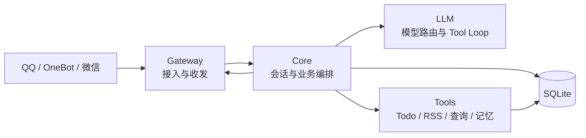

<div align="center">
  
  <h1>小女仆机器人</h1>
  <p><strong>一个会聊天、会记事、会调用工具，也会主动推送的轻量、自托管、多入口 AI Agent 机器人。</strong></p>
  <p>
    <a href="https://github.com/kuliantnt/qq-maid-bot/actions/workflows/ci.yml"></a>
    <a href="https://github.com/kuliantnt/qq-maid-bot/releases"></a>
    <a href="LICENSE"></a>
    <a href="https://deps.rs/repo/github/kuliantnt/qq-maid-bot"></a>
    
    
  </p>
  <p><sub>Rust 单进程 · 约 25 MiB 常驻内存 · 默认空闲时 3 个线程 · Provider 无关 Agent Loop · 多模态输入 · 主动推送 · 模型自动降级</sub></p>
</div>

项目使用 Rust 构建，当前以 QQ 官方机器人为主要入口，同时支持 OneBot 11 和可选的微信服务号文本入口。它在同一个进程中提供多轮会话、受控长期记忆、Todo 与提醒、RSS 推送、本地知识检索、联网查询、多模态理解和 Tool Calling。

> 💡 仓库早期以 QQ 机器人为主，因此仍保留 `qq-maid-bot` 名称。当前项目正在从 QQ 官方机器人演进为多入口平台型小女仆机器人。

稳定版本与升级说明见 [Releases](https://github.com/kuliantnt/qq-maid-bot/releases) 和 [CHANGELOG.md](./CHANGELOG.md)。

## 能做什么

- **聊天与上下文**：管理多轮会话，理解图片，并结合引用消息继续追问。
- **Todo 与提醒**：新增、修改、完成、恢复和删除待办，支持单次提醒、重复提醒和每日摘要。
- **查询与订阅**：查询天气、火车时刻和网页信息，订阅 RSS/Atom 并主动推送更新。
- **记忆与知识库**：用户明确要求“记住”时可直接保存长期记忆；普通聊天不会自动沉淀。本地 Markdown 可自动索引并按需检索。
- **受控工具调用**：模型只能调用服务端注册并按场景放行的工具，操作结果以真实执行或持久化结果为准。
- **多模型路由**：支持 OpenAI、Gemini、MiMo、DeepSeek 和 OpenAI-compatible Provider，并可按候选链自动降级。

## 平台支持

| 平台 | 状态 | 当前能力 |
| --- | --- | --- |
| QQ 官方机器人 | 主要入口 | C2C、群聊、图片理解、引用上下文、流式回复和主动推送 |
| OneBot 11 | 可选 | 单账号反向 WebSocket，支持私聊、群聊、图片理解、文件摘要和纯文本主动推送 |
| 微信服务号 | 可选 | 文本回调、同步回复和慢请求客服补发 |

OneBot 11 当前主要面向 NapCat，详细限制与接入步骤见 [OneBot 11 接入文档](./docs/development/onebot11-napcat.md)。微信服务号默认关闭，配置方式见 [runtime 运行文档](./runtime/README.md#微信服务号文本回调配置)。

## 快速开始

运行机器人至少需要启用一个入口，并配置一个可用的模型 Provider。使用 QQ 官方入口时，还需要 QQ 开放平台提供的 AppID 和 AppSecret。

### Linux 一键安装

安装脚本会根据 CPU 架构下载最新 Release，无需安装 Rust：

```bash
curl -fsSL https://github.com/kuliantnt/qq-maid-bot/raw/refs/heads/master/scripts/qbot.sh -o /tmp/qbot.sh
bash /tmp/qbot.sh deploy

qbot install
qbot config bot
qbot config ai
qbot start
qbot status
```

常用运维命令：

```bash
qbot log       # 跟随日志
qbot health    # 健康检查
qbot restart   # 重启服务
qbot update    # 更新版本
```

### Windows 一键安装

在 PowerShell 中下载安装器：

```powershell
$p="$env:TEMP\qbot.ps1"; Invoke-WebRequest https://github.com/kuliantnt/qq-maid-bot/raw/refs/heads/master/scripts/qbot.ps1 -OutFile $p -UseBasicParsing; powershell.exe -NoProfile -ExecutionPolicy Bypass -File $p install
```

然后编辑配置并启动：

```powershell
& "$HOME\qq-maid-bot\qbot.cmd" config path
notepad "$HOME\qq-maid-bot\config\.env"
& "$HOME\qq-maid-bot\qbot.cmd" start
& "$HOME\qq-maid-bot\qbot.cmd" status
```

当前 Windows Release 仅提供 x86_64 版本。手动下载 Release、开机启动和更新说明见 [runtime 运行文档](./runtime/README.md#release-包)。

### 从源码运行

需要已安装 Rust 工具链：

```bash
git clone https://github.com/kuliantnt/qq-maid-bot.git
cd qq-maid-bot
cp runtime/config/.env.example runtime/config/.env
vim runtime/config/.env
bash scripts/deploy-local.sh
runtime/botctl.sh status
```

开发调试、Windows 源码构建和测试命令见 [开发维护文档](./docs/DEVELOPMENT.md)。

## 配置方式

配置分为两层：

| 文件 | 用途 |
| --- | --- |
| `runtime/config/.env` | 入口凭证、Provider API Key、私有 Base URL、数据库和日志路径等部署配置 |
| `runtime/config/agent.toml` | 场景、模型候选链、profile、Tool Loop 预算和工具白名单等 Agent 策略 |

完整环境变量以 [`.env.example`](./runtime/config/.env.example) 为准。默认模型路线以 [`agent.toml`](./runtime/config/agent.toml) 为准；调整模型、工具或场景策略时，不需要修改业务代码。

配置文件、SQLite、日志、私有 Prompt 和知识资料都可能包含敏感信息，不要提交到公开仓库。

## 使用示例

```text
你：明天下午三点提醒我检查服务器日志
机器人：已新增待办：检查服务器日志
        提醒：明天 15:00

你：查看今天待办
机器人：📅 今天待办 · 共 2 项
        1. 检查服务器日志
        2. 更新周报

你：完成第一条
机器人：已完成待办：检查服务器日志

你：（发送一张报错截图）这是什么问题
机器人：这张图里的主要错误是……

你：/rss add https://example.com/feed.xml Rust News
机器人：已添加订阅：Rust News

你：/memory 我习惯使用 Asia/Shanghai 时区
机器人：🧠 已记住
        范围：个人记忆
        内容：你习惯使用 Asia/Shanghai 时区
```

<p align="center">
  <a href="docs/img/readme-chat-demo.png">
    
  </a>
  <a href="docs/img/readme-health-demo.png">
    
  </a>
</p>

## 架构概览



根目录 Cargo Workspace 统一管理四个 crate：

| 目录 | 职责 |
| --- | --- |
| `qq-maid-gateway-rs/` | 平台接入、事件转换、过滤去重和消息发送 |
| `qq-maid-core/` | `CoreService`、会话、记忆、Todo、RSS、知识库和业务 Tool |
| `qq-maid-llm/` | 模型协议、Provider 路由、fallback、SSE 和 Tool Loop |
| `qq-maid-common/` | 身份、消息结构、时间、Markdown 和脱敏等共享基础能力 |

依赖方向保持为 `gateway -> core -> llm -> common`。更详细的模块边界、项目结构和开发约定见 [docs/DEVELOPMENT.md](./docs/DEVELOPMENT.md)。

同一个架构，换个说法：

```text
用户说话 → 女仆长接单 → 各部门互相甩锅 → 工具拿真实结果说话 → SQLite 留档 → 大模型继续背锅
```

## 安全边界

- 只有注册到 Tool Registry 并被当前场景放行的工具可以调用；群聊默认不进入 Tool Loop。
- Todo 高风险操作和记忆清空、群画像停用等破坏性操作需要二次确认；明确的新增记忆请求校验通过后直接写入。
- 工具执行、Todo 写入和记忆保存都以真实结果为准，模型文案不能代替执行结果。
- 日志与诊断默认脱敏，不应输出凭证、完整平台 ID 或聊天正文。
- 本地管理面板默认关闭，仅适合本机或受控内网，不应直接暴露到公网。

## 常见问题

| 现象 | 优先检查 |
| --- | --- |
| 启动后立即退出 | 查看日志，确认入口配置完整且 Provider API Key 有效 |
| QQ 收不到消息 | 确认 QQ 开放平台事件权限和 Gateway WebSocket 连接状态 |
| 群聊不回复 | 默认 `mention` 模式只响应 @ 或对机器人消息的回复 |
| 模型调用失败 | 检查 API Key、Base URL 和模型前缀；兼容网关可能需要 `OPENAI_API_MODE=chat_only` |
| 升级后无法启动 | 对比新版 `config/.env.example` 是否新增或调整配置项 |

使用 `qbot health` 检查服务状态。网络和上游问题可运行发布包中的 `diagnose-network.sh`；完整排障方式见 [runtime 运行文档](./runtime/README.md#控制脚本和诊断)。

## 文档导航

| 文档 | 适合什么时候看 |
| --- | --- |
| [runtime/README.md](./runtime/README.md) | 安装、配置、运行数据、控制脚本、诊断和开机启动 |
| [docs/DEVELOPMENT.md](./docs/DEVELOPMENT.md) | 开发环境、架构边界、常用命令和检查要求 |
| [自定义 Tool 指南](./docs/development/custom-tools.md) | 新增或接入业务工具 |
| [OneBot 11 接入文档](./docs/development/onebot11-napcat.md) | 使用 NapCat 接入 OneBot 11 |
| [Gateway README](./qq-maid-gateway-rs/README.md) | 平台事件和消息发送实现 |
| [Core README](./qq-maid-core/README.md) | 会话、命令和业务编排实现 |
| [LLM README](./qq-maid-llm/README.md) | Provider、路由、SSE 和 Tool Loop 实现 |
| [Web Console README](./web-console/README.md) | 构建只读管理面板 |

## 参与项目

项目主要面向个人部署和开发者使用，仍在持续演进。提交 Issue 或 PR 前请阅读 [CONTRIBUTING.md](./CONTRIBUTING.md)，并避免附带 API Key、平台凭证、真实用户数据、聊天记录或私有知识资料。

- [GitHub Issues](https://github.com/kuliantnt/qq-maid-bot/issues)
- [版本变更](./CHANGELOG.md)
- [贡献者与鸣谢](./CONTRIBUTING.md#鸣谢)

## 今天女仆会不会罢工

- [x] 能聊天、能看图片
- [x] 能记 Todo、能设提醒
- [x] 能看天气、查火车
- [x] 能读 RSS、主动推送
- [x] 能查知识库、能联网搜索
- [x] 能自动切换模型、自动降级
- [x] 有 Provider 无关的统一 Agent Loop
- [x] 有受控长期记忆、明确新增直写和破坏性操作确认
- [x] 能在引用上一条消息或图片时保留上下文
- [ ] 接入更多可验证的业务 Tool
- [ ] 把 Todo、RSS 与后续能力打磨成完整通知平台
- [ ] 真正理解人类
- [ ] 阻止作者继续重构

## 赞助小店

项目接受小额赞助或相关服务合作。具体介绍和链接后续补齐。

| 名称 | 说明 |
| --- | --- |
| <a href="https://codexauv.com/register?aff=UNKHTN42CDRT"></a> | [CodexAuv](https://codexauv.com/register?aff=UNKHTN42CDRT) 提供面向开发者和企业团队的 AI 模型聚合与机器人托管服务 |

## 你可能不需要它，如果：

- 你只想要一个十行 Python 自动回复脚本
- 你不想维护数据库
- 你认为几万行 Rust 不算轻量
- 你希望模型可以不经确认直接操作宿主机
- 你不会在凌晨三点突然重构整个 LLM 层

## License

本项目基于 [MIT License](./LICENSE) 开源。

<!--
你居然看到了这里。

运行：
qq-maid-bot --summon-maid
-->
