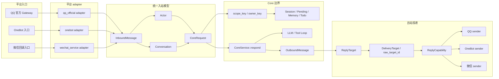

# Rust 平台入口与 QQ 文本网关

`qq-maid-gateway-rs/` 是 Rust 平台入口层，当前主入口是 QQ 官方 C2C / 群 at / 普通群文本接入，并包含可选微信服务号文本同步回调。旧 Python bot 接入层已经移除；新平台接入能力优先放到本 gateway 的 adapter / sender 边界，业务能力优先放到 `qq-maid-core/`。

## 多平台入口边界



这张图里的命名边界有固定含义：

- `InboundMessage` 是 Gateway 内部的平台无关入站模型，包含 `Actor` 与 `Conversation`。QQ、OneBot、微信等协议字段只能在各自 adapter 内解析。
- `CoreRequest` 是 Gateway 调用 Core 的稳定契约。Core 可以看到平台枚举、Actor 和 Conversation，但不理解 QQ `msg_seq`、stream id、微信 XML 字段或 OneBot CQ 片段。
- `scope_key` / `owner_key` 是业务隔离键，用于 Session、Pending、Memory、Todo 等状态归属，不是发送地址。
- `ReplyTarget` / `DeliveryTarget` 保存真实投递目标，必须保留平台和 `raw_target_id`。发送逻辑只能使用投递目标调用 sender，不能从 `scope_key` 或 `owner_key` 反解析平台 ID。
- RSS、Notification、Todo 提醒和 Push 这类主动投递也必须携带原始 delivery target；后续多平台收敛时不要把目标统一替换成 namespaced 字符串。

## 当前范围

- 处理 `C2C_MESSAGE_CREATE`、`GROUP_AT_MESSAGE_CREATE` 和普通 `GROUP_MESSAGE_CREATE` 文本消息；普通群消息默认采用 `mention` 模式，仅响应命令、@ 和回复机器人消息，可按配置关闭或改为提示词触发模式。
- `/ping` 会在 gateway 本地返回诊断信息，直接读取 Core 进程内健康快照；`/ping check` 会调用 `CoreService::upstream_check()` 执行一次不写会话的最小上游检查。
- 文本回复使用 QQ C2C `msg_type: 0`、原消息 `msg_id` 和递增 `msg_seq`。
- 入站附件不会改 Core 稳定请求模型；图片等附件信息会追加到文本末尾，例如 `[附件 image/jpeg: a.jpg https://example.test/a.jpg]`。
- Markdown 和图片保留独立 outbound 类型、payload 构造和发送入口；发送失败会 warn 并 fallback 到文本。C2C 流式回复当前固定使用 Markdown 流式载荷，首帧成功后不再补发普通全文。
- Core RSS 调度和 Todo 每日提醒通过进程内 `PushSink` 主动推送，不再暴露本机 HTTP push 入口。
- 微信服务号入口默认关闭；启用后只处理 GET URL 验证、POST 明文 `text` XML 和同步文本 XML 回复。Markdown 会降级为 text。
- 不做频道、频道私信、Ark、Embed、Keyboard、多租户或旧接入层兼容。
- 微信服务号暂不做加密 XML、客服消息、access_token 获取、模板消息、图片语音视频、事件、异步 follow-up、主动推送或流式输出。

## 开发边界

- QQ 平台字段解析、intent、白名单、消息去重和发送分支优先放在本目录维护。
- 普通聊天、查询、天气、翻译、session、todo、memory、RSS 指令、业务 Tool 和 prompt 组装放在 `qq-maid-core/`。
- gateway 调用 Core 时只走 `CoreService` 进程内接口，不要重新引入旧 `/query`、HTTP `/memory`、`/v1/chat` 或任何 localhost respond 调用路径。
- 主动推送只通过 `PushSink` 进程内边界进入 Gateway，不要恢复本机 push HTTP、push token 或 push 端口。
- 发送分支只接收 `ReplyTarget` / `DeliveryTarget` 里的平台原始目标；不要让 Core、LLM、Tool Loop 或业务 store 根据 `scope_key` 推断 QQ、OneBot 或微信发送参数。

## 源码边界

当前 Gateway 主链路按以下边界维护：

- `src/gateway/mod.rs`：运行域装配和顶层编排，只负责初始化共享状态、绑定进程内 push sink、维护重连循环，并把 WebSocket 协议处理委托给下层模块。
- `src/gateway/protocol.rs`：QQ Gateway WebSocket 协议层，负责 gateway 地址获取、HELLO/IDENTIFY/RESUME、心跳、READY/RESUMED、`INVALID_SESSION` 和 envelope 分发。
- `src/gateway/event.rs`：QQ 平台 payload 到 `C2cMessage` / `GroupMessage` 的解析与兼容字段处理。
- `src/gateway/cache.rs`：gateway 内部短时缓存，只保存 reply 回填和机器人 outbound message id 等可丢弃状态，不承载业务语义。
- `src/gateway/c2c.rs`：C2C 私聊消息处理管道，负责 Signal Layer 回填、本地 `/ping`、Core 调用和普通回复发送。
- `src/gateway/stream.rs`：C2C Markdown 流式发送状态机，负责分片、终包、QQ stream id/index 续接和普通回复 fallback 边界。
- `src/gateway/group.rs`：群消息处理管道，负责群消息到 Core 的调用、群回复发送和群 at 回复前缀。
- `src/gateway/group_filter.rs`：群消息过滤、触发策略和群/成员冷却判定。
- `src/gateway/outbound.rs`：QQ 出站发送包装和 runtime 发送状态记录，保持“真实发送结果再记录状态”的约束。
- `src/respond.rs`：gateway 到 CoreService 的进程内桥接层，负责 CoreRequest 映射、错误脱敏，以及 reply block / 附件备注拼接。
- `src/gateway/push.rs`：进程内主动推送实现。
- `src/gateway/wechat_service.rs`：微信服务号最小文本回调 HTTP 入口，只负责签名校验、明文 XML 解析、Core 调用和同步 XML 回复。
- `src/gateway/platform/wechat_service.rs`：微信服务号平台字段到统一 `InboundMessage` / `CoreRequest` 的映射，以及 XML 解析和渲染 helper。

维护时应尽量保持这些边界，不要把 WebSocket 协议细节、Core 业务调用和 QQ 发送状态记录重新堆回同一个超长文件。

## 配置

从仓库根目录复制模板并填入真实配置：

```bash
cp runtime/config/.env.example runtime/config/.env
```

默认配置入口位于运行目录，优先读取 `runtime/config/.env`，其次读取 `runtime/.env`；临时排障可用 `GATEWAY_ENV_FILE` 指向单独配置文件。

主要变量：

```env
QQ_BOT_APP_ID=你的QQ机器人AppID
QQ_BOT_APP_SECRET=你的QQ机器人AppSecret
QQ_BOT_SANDBOX=false
QQ_BOT_API_BASE=https://api.sgroup.qq.com
QQ_BOT_TOKEN_REFRESH_MARGIN_SECONDS=60
QQ_MAID_ENABLE_MARKDOWN=true
QQ_MAID_ENABLE_IMAGE=false
QQ_MAID_C2C_VISIBLE_PROGRESS_STATUS_ENABLED=true
QQ_MAID_GATEWAY_VERBOSE_LOG=false
QQ_MAID_GROUP_MESSAGE_MODE=mention
QQ_MAID_GROUP_ACTIVE_KEYWORDS=小女仆
QQ_MAID_BOT_MENTION_IDS=
RUST_LOG=info,qq_maid_gateway_rs=debug
```

兼容旧变量名：

```env
QQ_APPID=你的QQ机器人AppID
QQ_SECRET=你的QQ机器人AppSecret
```

普通群消息由 `QQ_MAID_GROUP_MESSAGE_MODE` 控制，默认 `mention` 保持有限触发；`off` 完全关闭普通群消息，`command` 只处理 `/` 或全角 `／` 开头的命令，`mention` 额外处理平台 @ 标记和回复机器人消息，`active` 只处理包含 `QQ_MAID_GROUP_ACTIVE_KEYWORDS` 指定提示词的普通群消息，提示词默认 `小女仆`，多个用英文逗号分隔。旧变量 `QQ_MAID_ENABLE_GROUP_MESSAGES` 仅在未设置新变量时兼容，`false` 映射为 `off`，`true` 映射为 `active`，未设置时默认 `mention`。群聊不会开放通用 Harness、文件处理或代码执行；Tool Calling 由 Core 的 `TOOL_CALLING_GROUP_ENABLED` 控制且默认关闭。gateway 只负责把群聊目标传给 Core，由 Core 按既有命令和普通聊天边界处理。

普通群事件是否 @ 当前机器人只信任官方结构化 `mentions[].is_you == true`；旧的 AppID、openid、member_openid、CQ 文本和 `<@...>` 文本不再作为触发依据。`QQ_MAID_BOT_MENTION_IDS` 仅保留为旧配置兼容，不应再用于修正普通群 @ 判定。不要把真实 ID 写入公开文档或提交到仓库。

普通群消息会过滤自己发送的消息、可识别的其它机器人消息、空内容/无附件消息和重复 `message_id`，并使用群级与群成员级内存冷却避免刷屏；但发送给 Core 的 `scope_key` 仍保持 `group:<group_openid>`，避免把 RSS、会话等按当前 QQ 目标建模的能力意外拆成成员分片。

`QQ_MAID_C2C_VISIBLE_PROGRESS_STATUS_ENABLED` 控制私聊 Tool Loop 的可见进度文本，默认开启，只在 Core 输出策略为 `progress_then_complete` / `progress_then_stream` 时发送一次受控短提示。它不是 QQ 原生 typing 状态；原生 typing 由 `QQ_MAID_AGENT_TYPING_ENABLED` / `QQ_MAID_AGENT_TYPING_DELAY_MS` 单独控制。

微信服务号最小配置：

```env
WECHAT_SERVICE_ENABLED=false
WECHAT_SERVICE_TOKEN=
WECHAT_SERVICE_APP_ID=
WECHAT_SERVICE_APP_SECRET=
WECHAT_SERVICE_BIND_HOST=127.0.0.1
WECHAT_SERVICE_BIND_PORT=8788
WECHAT_SERVICE_CALLBACK_PATH=/wechat/service
```

生产环境建议保持本机监听 `127.0.0.1`，由 Nginx、Caddy 或 Cloudflare Tunnel 把公网 HTTPS `https://你的域名/wechat/service` 转发到 `http://127.0.0.1:8788/wechat/service`。微信公众平台服务器配置中 URL 填公网 HTTPS 地址，Token 填 `WECHAT_SERVICE_TOKEN`，消息加解密方式选择明文模式，`EncodingAESKey` 当前未使用。详细配置和排障步骤见 [runtime/README.md](../runtime/README.md#微信服务号文本回调配置)。

`/ping all` 的调试详情会展示微信入口安全摘要，包括启用状态、监听地址和端口、callback path、`token` / `app_id` / `app_secret` 是否已配置、`access_token` 当前是否使用、当前支持模式和暂不支持能力。secret 类字段只显示 `configured` / `missing` / `not_used` 等摘要，不输出真实值；未启用时显示 `disabled`，不表示 QQ Gateway 异常。

不要提交真实配置文件、AppSecret、Access Token、openid、私聊内容或截图中的敏感信息。

## 日志

默认日志级别为 `info,qq_maid_gateway_rs=debug`，可写在运行目录配置：

```env
RUST_LOG=info,qq_maid_gateway_rs=debug
```

临时排障可在启动命令前覆盖：

```bash
RUST_LOG=debug make run
```

默认日志会记录 gateway 连接、READY/RESUMED、重连、收到 C2C 事件、调用进程内 CoreService、回发 QQ 消息和失败状态。日志中的 openid/user_id 会脱敏，不记录 QQ raw event envelope、Authorization header、AppSecret 或 token，也不默认打印消息正文。

确需查看解析后的消息正文时，可以临时开启：

```bash
QQ_MAID_GATEWAY_VERBOSE_LOG=true make run
```

也可以写入 `runtime/config/.env`：

```env
QQ_MAID_GATEWAY_VERBOSE_LOG=true
```

该开关只控制是否额外打印 `extracted_content` 字段，不改变 `RUST_LOG` 过滤级别。排障完成后应改回 `false`。

## 运行

统一程序会先启动 Core HTTP，再启动 Rust C2C gateway。前台调试时直接运行：

```bash
make run
```

部署后的控制脚本、真实 `.env` 位置、日志目录和运行产物说明见 [runtime/README.md](../runtime/README.md)。

## 检查

从仓库根目录执行：

```bash
make test-gateway
```

该命令会先检查 `qq-maid-common/`，再检查 gateway。gateway 自身检查等价于：

```bash
cargo fmt -p qq-maid-gateway-rs -- --check
cargo test -p qq-maid-gateway-rs
cargo check -p qq-maid-gateway-rs
```

第一版真机验收只要求：

- 能获取 QQ Access Token。
- 能连接 QQ Gateway。
- 能收到 C2C 文本事件。
- 能通过进程内 `CoreService` 调用 `qq-maid-core`。
- 能回发 C2C 文本。
- `/ping` 能直接返回 gateway 诊断信息。
- `/ping check` 能主动验证 LLM 鉴权、模型、参数和响应解析，且不写入聊天历史。
- 重复 `message_id` 不重复回复。
- WebSocket 断开后能自动重连。
